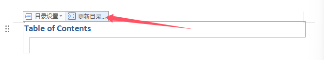
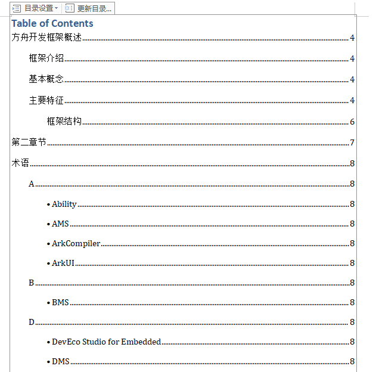

# 使用说明

## 上传文件说明

### 上传文件格式
上传的文件应为 `.zip` 压缩包。

### .zip 压缩包内容

* `your_zipName.zip`
  * `your_mdName.md`
  * `your_imgsFlieName/`

#### `your_mdName.md`
这是你的 Markdown 文件。

***注意：一次只能转化一个 Markdown 文档。***

#### `your_imgsFlieName/`
这是存放你在 Markdown 文件中使用的图片的文件夹。可以在该文件夹内创建子文件夹以方便归类图片。

## 转化格式说明

### 首先，上传 .zip 压缩包

### 然后，选择导出格式

### 如果选择 PDF

#### 注意事项

1. **logo** 是必填的。
2. 标题、封面页脚和版本号都会显示在封面（第一页）上。
3. 声明会单独占用一页。
4. 封面上不会显示左页眉和右页眉。

### 如果选择 Word

#### 注意事项

1. **logo** 是必填的。
2. 标题和版本号都会显示在封面（第一页）上。
3. 声明会单独占用一页。
4. 封面上不会显示左页眉和右页眉。
5. 如果想要显示目录，需要在 ***WPS*** 上单独操作，如下图所示：

点击之后就可以显示目录了。

### 如果选择 HTML

没有特别的注意事项。

# 注意

在编写md文档时，图片的前后都需要换行才能保证图片转化时，显示完全。